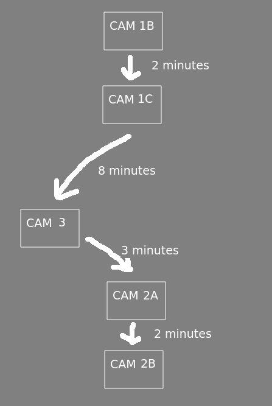

# bonneys-movement

Hello? Hello, hello? Uhh, I wanted to send a message to you... to help you better understand the program you're supposed to make for me.
As you know I'm a night guard as the Freddy Fazbear's Pizza and the animatronic characters get a bit quirky at night, the one I'm particulary worried about is the Bonney animatronic, he's been trying really hard to get into my office as of late and I've been having trouble keeping him tracked without wasting a lot of power on the camera system.
At the start of my shift he starts at the main stage and moves down to the office, tries to get in, and then goes back to the main stage where he starts doing the same thing in a loop until the night ends, he spends 1 minute inside a room with a camera before going into the next one,I've sent you an image that shows his movements as well as the time it takes for him to get from one camera to the next.

The image below should be a better visualizer of what was described.

What I need you to do is figure out what camera he is on, or if he's moving between 2 cameras, based on how much time passed since the start of the shift
Once you've done that I'll pay you as we discussed in our earlier messages.